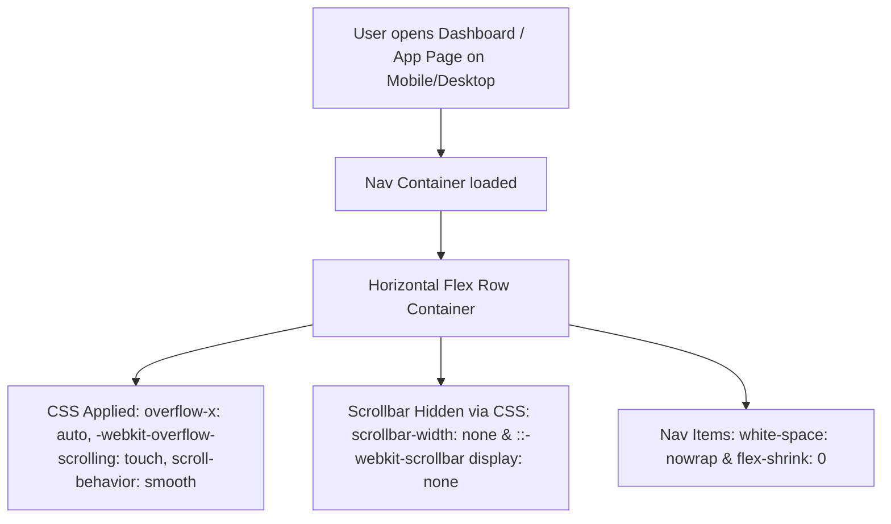

# Technical Plan: Implementation of Option 1 (The Scrollable Row) Navigation

## Overview
This plan details the implementation of Option 1 (The Scrollable Row) for the navigation header across the BelieversMeet application dashboards and main pages. The solution provides a clean, mobile-optimized horizontal scrollable row with hidden scrollbars, smooth touch inertia scrolling, and non-wrapping navigation labels.

---

## Architecture & Layout Workflow

---

## Detailed Modifications

### 1. CSS Extensions (`style.css`)
- **Scroll Container**: Add `.nav-scrollable-row` and enhance `.no-scrollbar` class:
  - `display: flex;`
  - `align-items: center;`
  - `overflow-x: auto;`
  - `white-space: nowrap;`
  - `-webkit-overflow-scrolling: touch;` (smooth inertia scrolling on WebKit/iOS mobile)
  - `scroll-behavior: smooth;`
  - `scrollbar-width: none;` (Firefox)
  - `-ms-overflow-style: none;` (IE/Edge)
  - `::-webkit-scrollbar { display: none; }` (Chrome/Safari/Opera)
- **Nav Link Item Styling**:
  - `flex-shrink: 0;` (prevents text compression or shrinking)
  - `white-space: nowrap;`
  - Touch-friendly padding (minimum 44px tap target height)

### 2. Centralized JavaScript Navigation (`js/nav.js`)
- Replace `<select id="central-nav-select">` with a horizontal scrollable link list container `.nav-scrollable-row.no-scrollbar`.
- Render all main navigation options as horizontal pill links.
- Highlight the active link based on `window.location.pathname`.

### 3. Page Header Updates
Ensure all HTML headers (e.g., `church-dashboard.html`, `admin.html`, `feed.html`, `events.html`, `groups.html`, `sermons.html`, `prayer-wall.html`, `testimonies.html`, `giving.html`, `profile.html`, `settings.html`, `inboxx.html`) use the updated navigation container without mobile `hidden` toggles, so mobile users seamlessly get horizontal touch scrolling.

---

## Plan Checklist
- [ ] Implement CSS utilities for `.nav-scrollable-row` and `.no-scrollbar` in `style.css`
- [ ] Refactor `js/nav.js` to build the scrollable row instead of a dropdown select
- [ ] Update HTML headers across core dashboards & pages
- [ ] Test mobile screen responsiveness and scroll behavior
